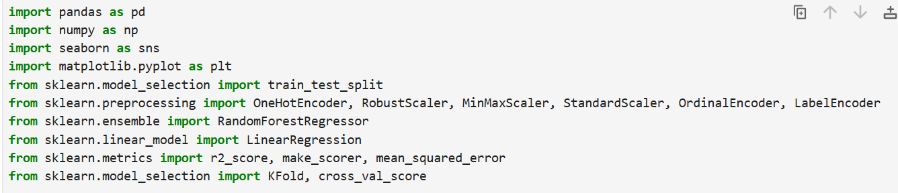
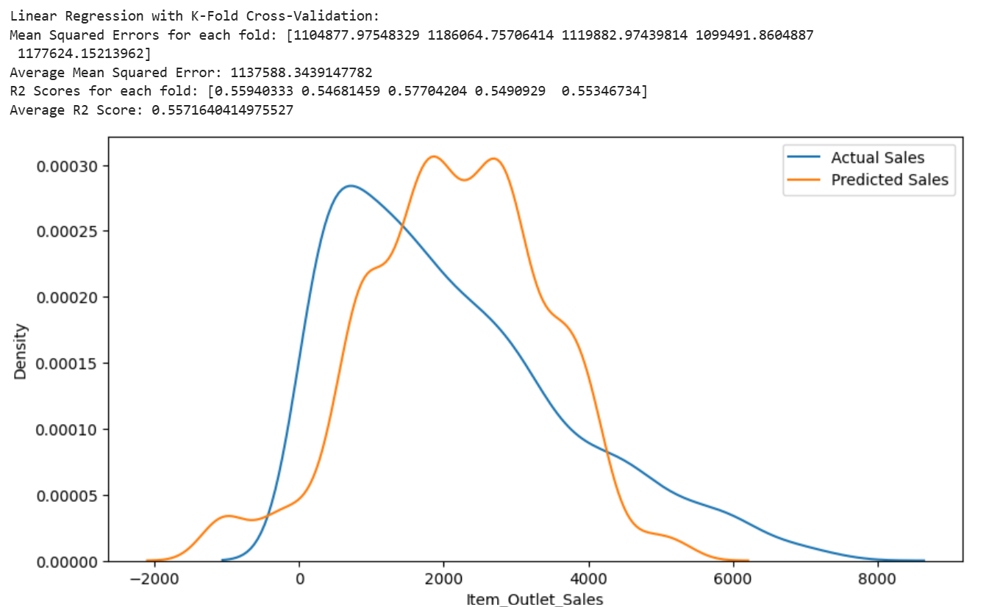

# Data science term project

Libraries to follow this project

**Purpose** : Use open source data file to make predict model

# Preprocessing
###### Use fillna, drop for missing values and droping columns
###### Define function to reduce Item_Type column's categories
###### Delete outliers and Label/OneHot/Ordinal encoding
###### Reduce bias because of feature influence by Scaling

# Feature selection
###### Visualize correlation by heatmap and use Random Forest  to check important features to predict Item_Outlet_Sales

# Model training
###### Use multiple regression to train and predict Item_Outlet_Size

# Evaluate
###### Use KFold Cross-Validation to evaluate by using scoring metrics  Mean Squared Error and R2 Square

# Visualize
###### Use matplotlib to visualize result by plot

# ***Result***:

# Reference:
###### https://velog.io/@ljs7463/%ED%9A%8C%EA%B7%80%EB%AA%A8%EB%8D%B8-%ED%8F%89%EA%B0%80%EC%A7%80%ED%91%9Cevaluation-metrics
###### https://coduking.tistory.com/entry/%EC%9B%90-%ED%95%AB-%EC%9D%B8%EC%BD%94%EB%94%A9-pdgetdummies-vs-OneHotEncoder
###### https://m.blog.naver.com/youji4ever/221712578078
###### https://dlearner.tistory.com/20
###### https://gmnam.tistory.com/302
###### https://wikibook.co.kr/ml-definitive-guide/
